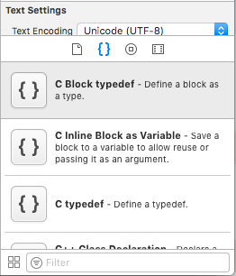
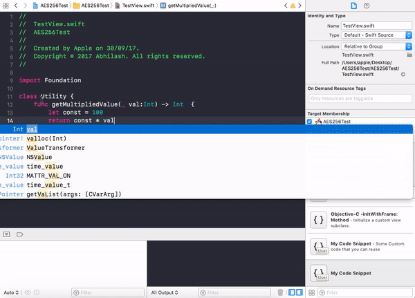
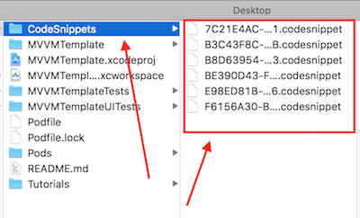

## Code snippet là gì?
Code snippet là một đoạn code được định nghĩa sẵn. Thay vì copy - paste những đoạn code có cấu trúc giống nhau thì khi sử dụng code snippet chỉ cần gõ shortcut thì Xcode sẽ tự động phát sinh đoạn code sẵn này. Code snippet giúp tiết kiệm được khá nhiều thời gian cho lập trình viên và tránh được những lỗi quên chỉnh lại code khi copy - paste vì code snippet có hỗ trợ placeholder_text.

Code snippet có sẵn trong Xcode:
 

Ngoài các code spippet có sẵn, Xcode cho phép chúng ta định nghĩa ra những code snippet mới. Chỉ cần tô đoạn code và kéo thả như sau:

 

Trong project này chúng tôi đã có định nghĩa sẵn một số code snippet để tiện cho việc sử dụng. Bạn chỉ cần làm theo hướng dẫn cài đặt bên dưới.

## Cách cài đặt

- Bước 1: Vào thư mục:

`~/Library/Developer/Xcode/UserData/`

- Bước 2: Kiểm tra xem có thư mục `CodeSnippets` chưa. Nếu chưa có thì copy nguyên thư mục `CodeSnippets` trong resource project và paste vào thư mục `~/Library/Developer/Xcode/UserData/`. Nếu có rồi thì chỉ cần copy các file trong thư mục và paste vào thư mục `~/Library/Developer/Xcode/UserData/CodeSnippets/`

## Cách sử dụng
Sau khi cài đặt thì ta chỉ cần gõ shortcut và bấm `enter` để Xcode tự phát sinh code mẫu như sau:

## Danh sách code snippet

| Title | Shortcut | Mô tả |
|-------|----------|------|
| MVVM - API Service Class | mvvm-apiServiceClass |  Tạo lớp API Service |
| MVVM - Model Class | mvvm-modelClass | Tạo lớp Model để parse dữ liệu trả về từ API server |
| MVVM - Table View Cell Class | mvvm-tableViewCellClass | Tạo sẵn các biến và function cho lớp Table View Cell |
| MVVM - View Controller Format | mvvm-viewController | Tạo sẵn các biến và function cho lớp View Controller |
| MVVM - View Model Class | mvvm-viewModelClass | Tạo lớp View Model |
| MVVM - View Model Protocol | mvvm-viewModelProtocol | Tạo protocol cho View Model |