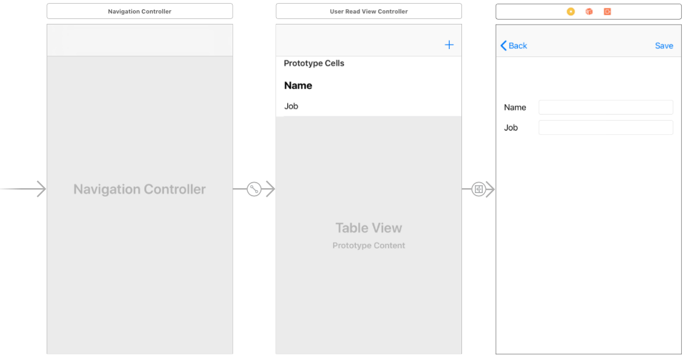

## Phần 2 - Ví dụ về thêm dữ liệu :memo:
Phần này được viết tiếp theo của [Phần 1 - Ví dụ hiển thị dữ liệu](ReadExample_vn.md), và tái sử dụng service và model đã tạo ở phần 1. Nếu trong quá trình đọc có phần nào không hiểu bạn có thể quay lại để đọc [Phần 1](ReadExample_vn.md) trước.

#### **Bước 1:** Áp dụng protocol Creatable cho Model
Mở file `User.swift`, áp dụng protocol **Creatable** và định nghĩa lại phương thức `createValue()` nếu có thêm các param đặc biệt ngoài các thuộc tính đã có sẵn trong class. Mặc định phương thức này sẽ tự động trả về Dictionary gồm các key và value tương ứng với object. Ở trong ví dụ này chúng ta không có param đặc biệt nên sẽ không cần phải định nghĩa phương thức này.

```swift
extension User : Creatable {}
```

#### **Bước 2:** Tạo View

- **Bước 2.1:** Mở file Main.storyboard, tạo navigation controller cho view controller đã tạo ở [Phần 1](ReadExample_vn.md), sau đó tạo 1 view controller có giao diện thêm tên và nghề nghiệp như hình bên dưới:

		

- **Bước 2.2:** Tạo ra 1 lớp con kế thừa từ **BaseViewController** trong group **Users**, đặt tên là `UserCreateViewController.swift`.
- **Bước 2.4:** Kết nối lớp **UserCreateViewController** tới view controller trên storyboard. Sau đó kéo IBOutlet cho `nameTextField`, `jobTextField` và `addButton`.

```swift
class UserCreateViewControllerBaseseViewController {
    
    @IBOutlet weak var nameTextField: UITextField!
    @IBOutlet weak var jobTextField: UITextField!
    @IBOutlet weak var addButton: UIBarButtonItem!
}
```


#### **Bước 3:** Tạo ViewModel
- **Bước 3.1:** Tạo 1 swift file, đặt tên là `UserCreateViewModel.swift` trong group **Users**.
- **Bước 3.2:** Mở file vừa tạo và import `RxCocoa` và `RxSwift`.
- **Bước 3.3:** Sử dụng code snippets `mvvmviewmodelprotocol` để tạo một protocol, đặt tên là `UserCreateViewModelType`. Ở đây ta sẽ có các input và output như sau:
    - Input:
        - `nameStringChangedEvent` và `jobStringChangedEvent` để kiểm tra giá trị nhập vào trên textfield.
        - `addButtonTappedEvent` là sự kiện tap trên button để thêm dữ liệu lên server.
    - Output:
        - `nameStringObservable` và `jobStringObservable` dùng để xét lại dữ liệu trên textfield về rỗng sau khi thêm thành công.
        - `addButtonEnableObservable` là trạng thái của nút add, nó sẽ enable khi giá trị nhập valid.
        - `successStringObvervable` và `errorStringObservable` dùng để hiển thị thông báo thành công và lỗi trong quá trình thêm dữ liệu.

```swift
protocol UserCreateViewModelType {

    //MARK: Input
    var nameStringChangedEvent: PublishSubject<String> {get}
    var jobStringChangedEvent: PublishSubject<String> {get}
    var addButtonTappedEvent: PublishSubject<Void> {get}

    //MARK: Output
    var nameStringObservable: Observable<String> {get}
    var jobStringObservable: Observable<String> {get}
    var addButtonEnableObservable: Observable<Bool> {get}
    var successStringObvervable: Observable<String> {get}
    var errorStringObservable: Observable<String> {get}

}
```

- **Bước 3.4:** Tiếp theo ta sử dụng code snippet `mvvmviewmodelclass` để tạo ra 1 lớp kế thừa từ protocol trên. Tại phương thức `init()` ta viết code để xử lý các sự kiện input từ view. Sử dụng phương thức `userService.create()` để thêm dữ liệu lên server. 

```swift
class UserCreateViewModel : UserCreateViewModelType {

    //MARK: Variable for output
    private var nameString = PublishSubject<String>()
    private var jobString = PublishSubject<String>()
    private var addButtonEnable = Variable<Bool>(false)
    private var successString = PublishSubject<String>()
    private var errorString = PublishSubject<String>()

    //MARK: Input
    lazy var nameStringChangedEvent = PublishSubject<String>()
    lazy var jobStringChangedEvent = PublishSubject<String>()
    lazy var addButtonTappedEvent = PublishSubject<Void>()

    //MARK: Output
    lazy var nameStringObservable: Observable<String> = self.nameString
    lazy var jobStringObservable: Observable<String> = self.jobString
    lazy var addButtonEnableObservable = self.addButtonEnable.asObservable()
    lazy var successStringObvervable: Observable<String> = self.successString
    lazy var errorStringObservable: Observable<String> = self.errorString

    //MARK: Variables
    private let userService = UserAPIService()
    private var user: User = User()
    private let disposeBag = DisposeBag()


    init() {

        //Listen when user typing and validate value
        nameStringChangedEvent.bind {[unowned self] (value) in
            self.user.name = value
            self.addButtonEnable.value = self.valid(user: self.user)
        }.disposed(by: disposeBag)

        jobStringChangedEvent.bind {[unowned self] (value) in
            self.user.job = value
            self.addButtonEnable.value = self.valid(user: self.user)
        }.disposed(by: disposeBag)

        //Solve when the user tap on save button
        addButtonTappedEvent.subscribe(onNext: {[unowned self] (_) in
            self.addUser()
        }).disposed(by: disposeBag)

    }


    //MARK: Helpful functions
    private func addUser() {
        userService.create(object: user, responeType: User.self, completionHandler: { (result) in
            self.addButtonEnable.value = true
            switch(result) {
            case .success(_):
                self.nameString.onNext("")
                self.jobString.onNext("")
                self.addButtonEnable.value = false
                self.successString.onNext("Creation was success!")
                break
            case .error(let err):
                self.errorString.onNext("Creation was error!")
                self.addButtonEnable.value = true
                break
            }

        })
    }


    private func valid(user: User) -> Bool {
        return user.job != "" && user.name != ""
    }
}
```


#### **Bước 4:** Truyền dữ liệu từ View Model lên View
Mở file `UserCreateViewController.swift`, import `RxSwift` và sử dụng code snippet `mvvmviewcontroller` để sinh ra code mẫu, tại đây ta sẽ truyền dữ liệu từ view model lên view như sau:

```swift
import RxSwift

class UserCreateViewController: UIViewController {

    ...


    //MARK: Private variables
    private let viewModel: UserCreateViewModelType = UserCreateViewModel()
    private let disposeBag = DisposeBag()

    //MARK: Public variables


    override func viewDidLoad() {
        super.viewDidLoad()

        // Do any additional setup after loading the view.
        //bindViewModel have to called before setupActions
        bindViewModel()
        setupActions()
    }


    //Bind Output data from viewModel
    func bindViewModel() {

        viewModel.nameStringObservable.bind(to: nameTextField.rx.text).disposed(by: disposeBag)

        viewModel.jobStringObservable.bind(to: jobTextField.rx.text).disposed(by: disposeBag)

        viewModel.addButtonEnableObservable.bind(to: addButton.rx.isEnabled).disposed(by: disposeBag)

        viewModel.successStringObvervable.bind {[unowned self] (value) in
            self.showMessage(title: "Success", message: value)
        }.disposed(by: disposeBag)

        viewModel.errorStringObservable.bind {[unowned self] (value) in
            self.showMessage(title:"Error", message: value)
        }.disposed(by: disposeBag)
    }


    //Map UI's actions to Input of the viewModel
    func setupActions() {

        //after 0.2s will send current value to the nameStringChangedEvent.
        nameTextField.rx.text.throttle(0.2, scheduler: MainScheduler.instance).subscribe(onNext: {[unowned self] (text) in
            self.viewModel.nameStringChangedEvent.onNext(text ?? "")
        }).disposed(by: disposeBag)

        jobTextField.rx.text.throttle(0.2, scheduler: MainScheduler.instance).subscribe(onNext: {[unowned self] (text) in
            self.viewModel.jobStringChangedEvent.onNext(text ?? "")
        }).disposed(by: disposeBag)

        addButton.rx.tap.subscribe(onNext: {[unowned self] _ in
            self.viewModel.addButtonTappedEvent.onNext(())
        }).disposed(by: disposeBag)
    }


    //MARK: Helpful functions
}
```


#### Cuối cùng: Chạy ứng dụng và xem kết quả :tada: :tada: :tada: 
Nếu bạn kiểm tra trên server thấy data nhưng khi bấm back không thấy data hiển thị trên table view :anguished: :anguished: :anguished: Something was wrong here? :worried: :worried: :worried:

==> Lý do là vì ở phần 1 ta chỉ xử lý load data khi init view model, do đó khi bấm back thì view model không được khởi tạo lại và dữ liệu sẽ không được làm mới. Để xử lý phần này ta cần chỉnh lại như sau:

###### **Bước 1:** Tạo input ở view model
- **Bước 1.1:** Mở file `UserReadViewModel.swift` và khai báo input ở protocol `UserReadViewModelType`

```swift
protocol UserReadViewModelType {

    //MARK: Input
    var reloadUserListEvent: PublishSubject<Void> {get}

    //MARK: Output
    ...

}
```

- **Bước 1.2:** Định nghĩa input ở lớp **UserReadViewModel** và thay vì gọi phương thức `loadUser()` tại init thì ta sẽ gọi khi có sự kiện load dữ liệu:

```swift
class UserReadViewModel: UserReadViewModelType {

    //MARK: Variable for Output
    ...

    //MARK: Input
    lazy var reloadUserListEvent = PublishSubject<Void>()

    //MARK: Output
    ...

    //MARK: Variables
    ...
    private let disposeBag = DisposeBag()


    init() {

        //Listen refresh data requirement from UI
        reloadUserListEvent.bind {[unowned self] in
            self.loadUser()
        }.disposed(by: disposeBag)

    }


    ...

}
```

###### **Bước 2:** Gọi reload dữ liệu trên View
Mở file `UserReadViewController.swift`, override phương thức **viewWillAppear()** và gọi sự kiện reloadUser như sau:

```swift
override func viewWillAppear(_ animated: Bool) {
    super.viewWillAppear(animated)
    viewModel.reloadUserListEvent.onNext(())
}
```

==> Chạy lại và kiểm tra kết quả :tada: :tada: :tada: 

Tiếp tục với [Phần 3 - Ví dụ về update dữ liệu](UpdateExample_vn.md)
