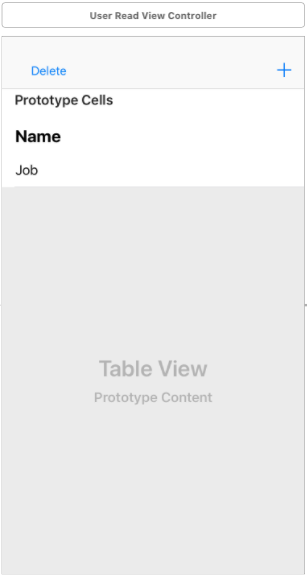

## Phần cuối - Ví dụ về delete dữ liệu :x:
Phần này được viết tiếp theo của [Phần 3 - Ví dụ về update dữ liệu](UpdateExample_vn.md). Trong phần này ta tái sử dụng service và model đã tạo ở phần 1 và phần 3. Nếu trong quá trình đọc có phần nào không hiểu bạn có thể quay lại để đọc [Phần 1](ReadExample_vn.md), [Phần 2](CreationExample_vn.md) và [Phần 3](UpdateExample_vn.md) trước.

**Lưu ý**: Để xoá được thì ta cần áp dụng protocol **Updateable** cho Model ta đã làm ở **Bước 1** của [Phần 3](UpdateExample_vn.md) nên ở đây ta sẽ bỏ qua bước này.

#### **Bước 1:** Chỉnh sửa giao diện
- **Bước 1.1:** Thêm button delete vào giao diện danh sách user như hình bên dưới



- **Bước 1.2:** Cấu hình state cho button, `Default` sẽ hiển thị title là **Delete** và `Selected` sẽ hiển thị title là **Done**.

- **Bước 1.3:** Kết nối IBOutlet cho nút `delete`

```swift
class UserReadViewController: UIViewController {

    @IBOutlet weak var userTableView: UITableView!
    @IBOutlet weak var deleteButton: UIButton!

    ...
}
```

#### **Bước 2:** Xử lý lại view model

- **Bước 2.1:** Mở file `UserReadViewModel.swift` và khai báo thêm một số input và output trong protocol **UserCreateViewModelType** để thực hiện được tính năng xoá dữ liệu như sau:
    - Input: `deleteButtonTappedEvent` để lắng nghe người dùng bấm nút delete và `deletedUserEvent` để lắng nghe chọn dòng delete trên table view.
    - Output: `selectedDeleteButtonObservable` để truyền trạng thái selected của nút delete view.

```swift
protocol UserReadViewModelType {

    //MARK: Input
    ...
    var deleteButtonTappedEvent: PublishSubject<Void> {get}
    var deletedUserEvent: PublishSubject<IndexPath> {get}

    //MARK: Output
    ...
    var selectedDeleteButtonObservable: Observable<Bool> {get}

}
```
	
- **Bước 2.2:** Định nghĩa các thuộc tính mới và xử lý khi người dùng delete ở lớp **UserReadViewModel**. Gọi phương thức  `userService.delete()` để delete dữ liệu ở server, sau khi kết quả trả về là `success` thì ta chỉ cần xoá user tại vị trí `indexPath.row` trong `userList` thì UI sẽ tự động được cập nhật theo. Cụ thể code sẽ như sau:

```swift
class UserReadViewModel: UserReadViewModelType {

    //MARK: Variable for Output
    ...
    private var selectedDeleteButton = Variable<Bool>(false)

    //MARK: Input
    ...
    lazy var deleteButtonTappedEvent = PublishSubject<Void>()
    lazy var deletedUserEvent = PublishSubject<IndexPath>()

    //MARK: Output
    ...
    lazy var selectedDeleteButtonObservable: Observable<Bool> = self.selectedDeleteButton.asObservable()


    init() {

        ...

        deleteButtonTappedEvent.bind {[unowned self] in
            self.selectedDeleteButton.value = !self.selectedDeleteButton.value
        }.disposed(by: disposeBag)

        //Listen the deleted person.
        deletedUserEvent.bind {[unowned self] (indexPath) in
            self.deleteUser(at: indexPath)
        }.disposed(by: disposeBag)

    }

    ...

    private func deleteUser(at indexPath: IndexPath) {
        let user = self.userList.value[indexPath.row]
        userService.delete(object: user, responeType: User.self) {[unowned self] (result) in
            switch (result) {
            case .success(_):
                //Remove the person in list after deleted at server.
                 self.userList.value.remove(at: indexPath.row)
                break
            case .error(let error):
                //we can show message here
                 CommonHelper.print(type: .error, atFunc: "deleteUser", message: "Delete user got an error: " + error)
                break
            }
        }
    }
}
```


#### **Bước 3:** Xử lý trên view 
- **Bước 3.1:** Mở file `UserReadViewController.swift`, tại phương thức `setupActions()` viết code truyền sự kiện nhấn vào button delete và chọn dòng delete trên table view cho view model

```swift
func setupActions() {

    ...

    deleteButton.rx.tap.subscribe(onNext: {[unowned self] _ in
        self.viewModel.deleteButtonTappedEvent.onNext(())
    }).disposed(by: disposeBag)

    //call viewModel when the user deleted cell in table view
    userTableView.rx.itemDeleted.bind(to: viewModel.deletedUserEvent).disposed(by: disposeBag)

}
```

- **Bước 3.2:** Xử lý lắng nghe trạng thái selected của nút delete tại phương thức `bindViewModel()` như sau:

```swift
func bindViewModel() {

    ...

    viewModel.selectedDeleteButtonObservable.bind{[unowned self] value in
        self.deleteButton.isSelected = value
        self.userTableView.isEditing = value
    }.disposed(by: disposeBag)
}
```

#### Cuối cùng: Chạy ứng dụng và xem kết quả :tada: :tada: :tada: 