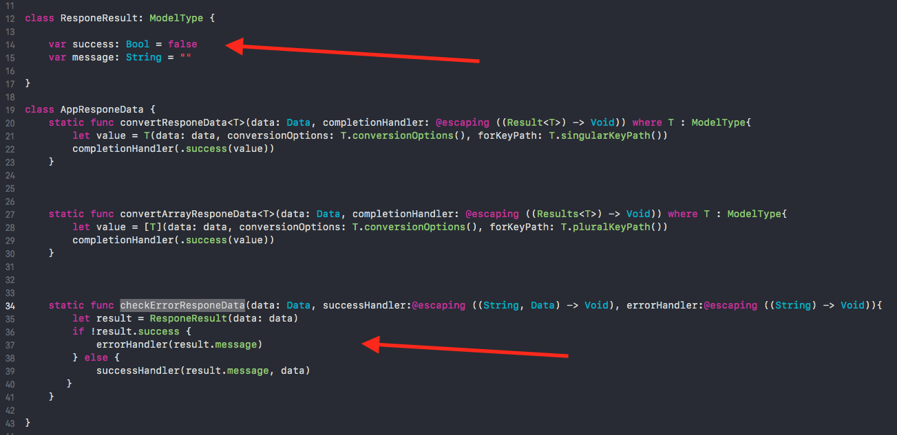
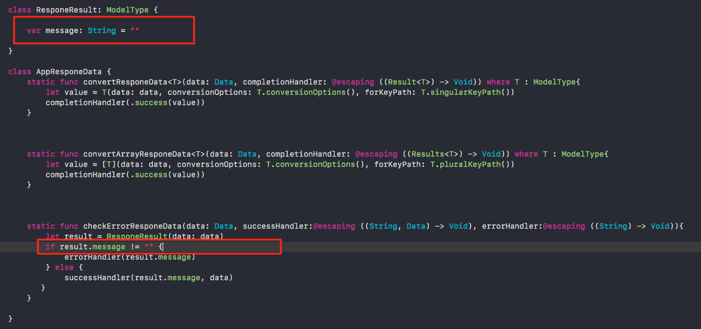

## Hướng dẫn phân tích data và tạo model
#### 1. Định dạng cấu trúc data trả về
Ví dụ ta có dữ liệu server sẽ trả về chi tiết user và danh sách user như sau:

```json
{
    "success": true,
    "message": "",
    "user": {
        "name": "Thuy",
        "job": "Developer"
    }
}
```

```json
{
    "success": true,
    "message": "",
    "users": [
        {
            "name": "Thuy",
            "job": "Developer"
        }
    ]
}
```

Như vậy ta thấy cấu trúc server trả về theo dạng dictionary gồm `success`, `message` và key `user` sẽ thay đổi tuỳ thuộc vào API. Tuy nhiên nó vẫn theo quy tắc là nếu trả về 1 danh sách thì key sẽ có thêm `s` phía sau. Đây là định dạng chuẩn của một dữ liệu trả về. 

Nếu trong trường hợp cấu trúc data trả về thay đổi như thêm field hoặc thay đổi tên field ví dụ như:

```json
{
    "message": "",
    "user": {
        "name": "Thuy",
        "job": "Developer"
    }
}
```

Thì ta sẽ phải vào file **AppResponeData.swift** để định nghĩa lại thuộc tính có trong lớp **ResponeResult** tương ứng với data mẫu. Sau đó chỉnh lại code kiểm tra lỗi trả về từ server trong phương thức `checkErrorResponeData()` của lớp **AppResponeData**



Theo ví dụ trên thì ta sẽ chỉnh lại như sau:


#### 2. Model Class

Một lớp model sẽ gồm các phần sau:

```swift
class Model : ModelType {

    //MARK: API Properties
    var name: String = ""

    override class func singularKeyPath() -> String {
        return "user"
    }

    //Key path of plural respone data
    //Override this function when the respone data have a special key. By default is adding `s` at the end.
    override class func pluralKeyPath() -> String {
    	return "users"
    }

    
    //Options will be use when convert from json to object or vice versa
    override class func conversionDeserializeOptions() -> ConversionOptions {
    	return ConversionOptions.DefaultDeserialize
    }

    override class func conversionSerializeOptions() -> ConversionOptions {
    	return ConversionOptions.DefaultSerialize
    }
    
}
```

Trong đó:
- **API Properties**: Định nghĩa các thuộc tính tương ứng với dữ liệu trả về từ API
- **singularKeyPath()**: là phương thức định nghĩa key chứa dữ liệu của một object.
- **pluralKeyPath()**: là phương thức định nghĩa key chứa dữ liệu trả về một danh sách các object.
- **conversionDeserializeOptions()**: Là phương thức sẽ quy định cách convert dữ liệu json trả về. Vì template này sử dụng thư viện [EVReflection](https://github.com/evermeer/EVReflection) nên phương thức này sẽ trả về các kiểu convert có sẵn của EVReflection. Xem [Conversion Options](https://github.com/evermeer/EVReflection#conversion-options) để biết thêm chi tiết.
- **conversionSerializeOptions()**: Ngược lại với phương thức `conversionDeserializeOptions()`, phương thức này quy định cách convert dữ liệu của object thành json hoặc dictionary.

Sau đây là một số ví dụ và cách tạo class tương ứng:

###### - Key data trả về theo dạng chuẩn
Ví dụ ta có dữ liệu server sẽ trả về chi tiết user và danh sách user như sau:

```json
{
    "success": true,
    "message": "",
    "user": {
        "name": "Thuy",
        "job": "Developer"
    }
}
```

```json
{
    "success": true,
    "message": "",
    "users": [
        {
            "name": "Thuy",
            "job": "Developer"
        }
    ]
}
```

Như vậy ta thấy cấu trúc server trả về theo quy tắc là nếu trả về 1 danh sách thì key sẽ có thêm `s` phía sau. Đây là dạng chuẩn do đó ta chỉ cần tạo ra một class kế thừa từ **ModelType** và định nghĩa lại `singularKeyPath()`. Theo ví dụ data ở trên thì ta sẽ có 1 class model như sau:

```swift
class User : ModelType {

    //MARK: API Properties
    var name: String = ""
    var job: String = ""

    override class func singularKeyPath() -> String {
        return "user"
    }

}
```


###### - Key data trả về không theo chuẩn
Nếu dữ liệu server trả về không đúng chuẩn như sau:

```json
{
    "success": true,
    "message": "",
    "data": {
        "name": "Thuy",
        "job": "Developer"
    }
}
```

```json
{
    "success": true,
    "message": "",
    "userslist": [
        {
            "name": "Thuy",
            "job": "Developer"
        }
    ]
}
```

Với trường hợp này thì lớp model phải override lại phương thức `pluralKeyPath()` tương ứng với key data trả về dạng danh sách:

```swift
class Model : ModelType {

    ...

    override class func singularKeyPath() -> String {
        return "data"
    }

    override class func pluralKeyPath() -> String {
    	return "userslist"
    }

}
```

###### - Thay đổi từ khoá convert data
Như đã nói ở trên, template này sử dụng thư viện [EVReflection](https://github.com/evermeer/EVReflection) và mỗi model class kế thừa từ ModelType đều là lớp con của EVObject. Do đó các class này sẽ có sẵn những phương thức hỗ trợ chuyển đổi dữ liệu như `propertyMapping()` , `propertyConverters()`,... như vậy ta có thể sử dụng tương tự như trong [document của EVReflection](https://github.com/evermeer/EVReflection#custom-keyword-mapping).

Ví dụ ta có 1 lớp model như sau:

```swift
class User : ModelType {

    //MARK: API Properties
    var name: String = ""
    var job: String = ""

}
```

Tuy nhiên trên server lại đổi từ khoá `name` thành `username`. Để tránh phải chỉnh sửa lại code, ta chỉ cần override phương thức `propertyMapping()` như sau:

```swift
override func propertyMapping() -> [(keyInObject: String?, keyInResource: String?)] {
    return [(keyInObject: "name", keyInResource: "username")]
}
```

Tuy nhiên giải pháp này chỉ áp dụng cho trường hợp data trả về không có field nào có key là `name`. Nếu không nó sẽ ưu tiên và tự hiểu field `name` đó chính là property **name** => khai báo trong `propertyMapping()` sẽ không có tác dụng.

Bạn có thể tham khảo [các ví dụ của EVReflection](https://github.com/evermeer/EVReflection#custom-keyword-mapping) để biết thêm chi tiết.