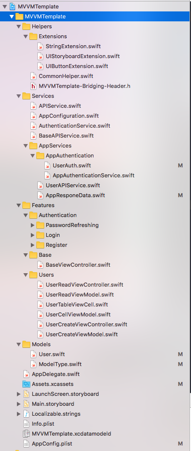

## Project hierarchy 
 
- **Helpers:** Includes extension files and helper classes
	- **UIStoryboardExtension.swift:** This file will define the view controller in storyboards through `Storyboard Identifier`
	- **CommonHelper.swift:** This file will have static functions to support another class in project.
- **Services**
	- **APIService.swift:** Define protocol and enum to support for BaseAPIService.
	- **BaseAPIService.swift:** This is an abtrast class, it has CRUD request methods to server.
	- **AuthenticationService.swift:** Define authentication methods.
	- **AppConfiguration.swift:** This is a singleton class, it includes some configuations in app.
	- **AppServices:** Includes your app services. Your service classes should be children of BaseAPIService. and have to override `resourceName` method
		- **UserAPIService.swift:** An example of service class
		- **AppResponeData.swift:** Define structure of the result that server will return. And define how to parse those results.
		- **AppAuthenticationService.swift:** This file implements the authetication methods from **AuthenticationService** protocol.
		- **UserAuth.swift:** This is a model class. It represents the current user logined.
- **Features:** Includes feartures in your app.
	- **BaseViewController.swift:** this is base class for View Controllers in App.
	- **Users:** This is an example for a feature.
		- **UserReadViewController.swift:** This is a View class.
		- **UserReadViewModel.swift:** This is a ViewModel class.
- **Models:** Includes model classes. 
	- **ModelType.swift:** This file defines a basic Model class.
- **AppConfig.plist:** This file is a config file. You have to edit this file suitable for your app.