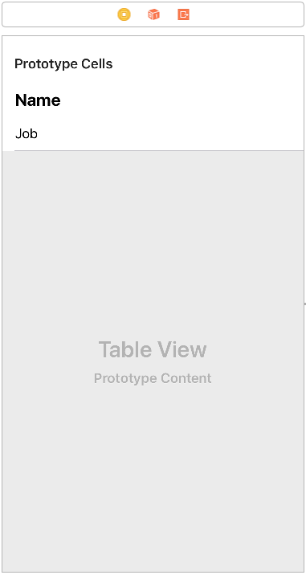

## Part 1 - Read example :page_facing_up:
For this example I used [https://getsandbox.com/](https://getsandbox.com/) as a server to provide APIs and save data. And I have had a list of user info (includes name and job) in the server.
Note: You have to edit `baseURL` at **BaseAPIService.swift** file to match with your base url of API. For example, we have a read API is `https://reqres.in/api/users` . So we have:
- `baseURL` : `https://reqres.in/api/`
- `resourceName` : `users` 


#### **Step 1:** Prepare services
- **Step 1.1:** Create a swift file with name is `UserAPIService.swift` in **AppServices** group.
- **Step 1.2:** Open the file and write code to create `UserAPIService` class inherite from `BaseAPIService`. Override `resourceName` function to return the name of resource.

```swift
class UserAPIService: BaseAPIService {

    override func resourceName() -> String {
       return "users"
    }
}
```


#### **Step 2:** Define Model
- **Step 2.1:** Create a swift file with name is `User.swift` in **Model** group.
- **Step 2.2:** Open the file and write code to define properties matching with response data from server. 

```swift
import ObjectMapper

class User : Mappable {

    var name: String = ""
    var job: String = ""
    
    //Define key for api
    private enum APIKey: String {
        case name = "name"
        case job = "job"
    }

    init(){
        
    }

    required init?(map: Map) {
        mapping(map: map)
    }


    func mapping(map: Map) {
        name <- map[APIKey.name.rawValue]
        job <- map[APIKey.job.rawValue]
    }
}
```


#### **Step 3:** Create View

- **Step 3.1:** Open storyboard and create a view controller has an interface looks like the image below.

	
	
- **Step 3.2:** Create a child group in `Feature` group, called `UserReadExample` or whatever you like.
- **Step 3.3:** Create a child class of UIViewController class, called `UserReadViewController.swift` in `UserReadExample` group.
- **Step 3.4:** Connect the UserReadViewController class to the view controller in storyboard. Then connect IBOutlet for the table view in view controller.

```swift
class UserReadViewController: UIViewController {

    @IBOutlet weak var userTableView: UITableView!
    ...
}
```

- **Step 3.5:** Create a child class of UITableViewCell, called `UserTableViewCell` in `UserReadExample` group.
- **Step 3.6:** Connect the UserTableViewCell class to table view cell and connect IBOutlet for `nameLabel` and `jobLabel` in cell.

```swift
class UserTableViewCell: UITableViewCell {
    @IBOutlet weak var nameLabel: UILabel!
    @IBOutlet weak var jobLabel: UILabel!
}
```

- **Step 3.7:** Set **identifier** of cell equal `cell`.


#### **Step 4:** Create ViewModel
- **Step 4.1:** Create a swift file, called `UserReadViewModel.swift` in `UserReadExample` group.
- **Step 4.2:** Open the swift file and write Import `RxCocoa` and `RxSwift`.
- **Step 4.3:** Write code to create a protocol, called `UserReadViewModelType` or whatever you like but it should follow [the naming rules](Naming.md#view-model). This protocol is used to define inputs and outputs in view model. At this example, We just need to show the list of user so we don't have any input from view.

**Note:** If you haven't known about RxSwift, you have to research it first. You can read [RxSwift For Dummies](http://swiftpearls.com/RxSwift-for-dummies-1-Observables.html) of **Michal Ciurus**.

```swift
protocol UserReadViewModelType {

    //MARK: Input

    //MARK: Output
    var userListObservable: Observable<[User]> {get}

}
```

- **Step 4.4:** Write code to create a class inherite from the above protocol. Use `userService.read()` to read data from server. 

```swift
class UserReadViewModel: UserReadViewModelType {

    //MARK: Variable for Output
    private var userList = Variable<[User]>([])

    //MARK: Input

    //MARK: Output
    lazy var userListObservable: Observable<[User]> = self.userList.asObservable()

    //MARK: Variables
    private let userService = UserAPIService()


    init() {

    	self.loadUser()

    }


    func loadUser() {
        userService.read(predicate: nil, type: User.self) {[weak self] (result) in
            switch (result) {
            case .success(let array):
                //update userList
                self?.userList.value = array
                break
            case .error(let error):
                //we can show message here
                break
            }
        }
    }

}
```


#### **Step 5:** Create view model for cell
- **Step 5.1:** Create a swift file with name is `UserCellViewModel` in `UserReadExample` group.
- **Step 5.2:** Open the file and write code to define values will perform in cell.

```swift
import RxSwift

struct UserCellViewModel {
    //MARK: Output
    let nameString = BehaviorSubject<String>(value: "")
    let jobString = BehaviorSubject<String>(value: "")


    
    init(user: User) {
        nameString.onNext(user.name)
        jobString.onNext(user.job)
    }
}
```


#### **Step 6:** Bind data from ViewModel to View
- **Step 6.1:** Open `UserTableViewCell` file, import `RxSwift` and write code to bind data from view model

```swift
import RxSwift

class UserTableViewCell: UITableViewCell {
    ...

    private var disposeBag = DisposeBag()

    //Use a trigger that when the viewModel change we will register observers to show data into view
    var viewModel: UserCellViewModel? {
        didSet {
            bindViewModel()
        }
    }


    override func prepareForReuse() {
        super.prepareForReuse()
        //You have to re-create a new DisposeBag to clear the old observers
        disposeBag = DisposeBag()
    }


    func bindViewModel() {

        viewModel?.jobString.bind(to: jobLabel.rx.text).disposed(by: disposeBag)

        viewModel?.nameString.bind(to: nameLabel.rx.text).disposed(by: disposeBag)
    }
}
```

- **Step 6.2:** Open `UserReadViewController` file, import `RxSwift` and write code to bind data from view model

```swift
import RxSwift

class UserReadViewController: UIViewController {

    ...
    
    private let viewModel: UserReadViewModelType = UserReadViewModel()
    private let disposeBag = DisposeBag()


    override func viewDidLoad() {
        super.viewDidLoad()
        // Do any additional setup after loading the view.
        bindViewModel()
    }

    func bindViewModel() {

        viewModel.userListObservable.bind(to: userTableView.rx.items(cellIdentifier: "cell", cellType: UserTableViewCell.self)) {
            index, item, cell in
            //set viewModel for cell => the same with show data to cell
            cell.viewModel = UserCellViewModel(user: item)
        }.disposed(by: disposeBag)

    }
}
```


#### Finally: Run and see the result :tada: :tada: :tada: 
Continues with [Part 2 - Create Example ](CreateExample.md)
